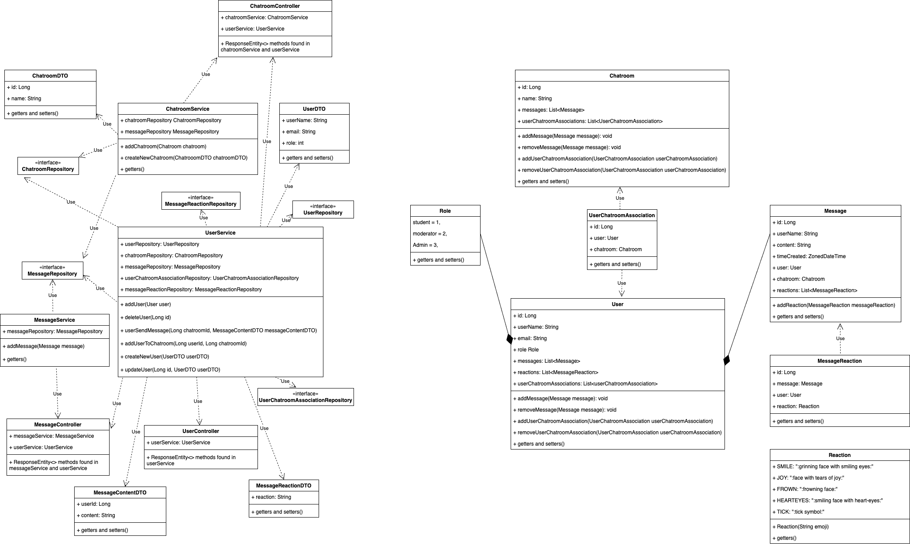

# **Group 1: Backend for a Chatroom**

## 👥🎸 The Chatter Beans Developer Team 🎸👥
- GitHub: [Albert](https://github.com/Al-B-code)
- GitHub: [Arianna](https://github.com/Ariannacoseschi)
- GitHub: [Emily](https://github.com/remily23)
- GitHub: [Ryan](https://github.com/RyanNekadio)

## Table of Contents

1. Introduction
2. Technologies & Frameworks
3. Installation Instructions
4. ERD & Class Diagrams
   - 4.1. Initial Diagram Drafts
   - 4.2. Final Diagrams
5. Chatroom Functionality
   - 5.1. MVP 🫡
   - 5.2. Extensions 💪
6. API Routes

## 1. Introduction 
Based on BNTA’s Slack workspace, we wanted to adapt and improve the functionality of the messaging platform for an educational environment.

## 2. Technologies & Frameworks
- Java 17
- Spring Boot
  - Dev Tools
  - PostgreSQL Driver
  - Data JPA SQL
- IntelliJ IDEA IDE
- Postman
- Postico
- GitHub

## 3. Installation Instructions
1. Clone the project from the [repo](https://github.com/Al-B-code/backend_chatroom)
2. Open the project in IntelliJ
3. Create a database called "chatroom_db"

## 4. ERD & Class Diagrams

## 4.1. Initial Diagram Drafts

Our initial diagrams to illustrate our planning at the start of this project.

**UML:** 

.drawio#R7Vxrc6I6GP41zuz50B1uUvux2m23e9odt%2B6tH1NIJaeBcCBW3V%2B%2FbyAoEKroitotM50peUmCyfPkvSXQMQf%2B7CpCoXfLXEw7hubOOuZFxzB0zbTgn5DMU4mlnaWCcURcWWkpGJFfOGsppRPi4rhQkTNGOQmLQocFAXZ4QYaiiE2L1R4ZLT41RGOsCEYOoqr0B3G5l0p7xulS%2FhGTsZc9Wbfl%2BHyUVZYjiT3ksmlOZH7omIOIMZ5e%2BbMBpmLysnn5cT3%2FQW%2Be7KtPX%2BL%2F0bf%2Bv18%2Ffz9JO7vcpMliCBEO%2BNZd%2F3p6vPz43frvZzi8%2FDLVrs4fPp3IJtozohM5X5MYR9cBx9EjcrAcOJ9nsxlPiU9RAKX%2BIwv4SN6BuegjSsYBXDtYtAbBM444ASDO5Q3OQpA6HqHuDZqziRhKzJHzlJX6HovIL%2BgWUbilgwBuR1xyyrALNUaiJYg1kEY4hjrDbH70hegGxVzWcRilKIzJQ%2FKDRRUfRWMS9BnnzM86YpPAxa4sLQBPCjxiTwsKifY1UZHoidnAsxwnJUpXmPmYR3OoIu8atkRFrjhTFqdL%2BupZFS9P3TMpRHLJjBddL552B0sMBWOYg%2BXjzOLjdKvm8wCQwuMQBdwDxHFfzGKcJyNc5Ea6FCUU3YCuukLXAPliLCMekWCs0BVmnOeoSfEjf5GYcYgc6OMmqXNhLSV3cshCxKDtI01I4RHXxUFCGo44SnklmBIyEvBkTrp9%2BIOZG2jvu50u%2FKABlPVlGf5E9YgPWAD8QiQhEgbSTrEgbgXFVq7i9RSbF6HbFOI8owrYbgqkUal3Pv%2FVYK5QLh73qbxsCvKusT%2FIb5%2FNTxe9y293P108nl%2Fd3z8T98RSFy%2F2EaHnrgvKOm5xbwb3096Bl7qpwJ6absOmYnZ8wF64cIY9Xmq8Fv0doa9r1oHhtxT4FYgpSRxKOR16pbO1Bn8fkBTdZYB%2FFXy4ONEVUpgqKcwKAlD0gOmQxYQTJvqP0rolYhzKfOt1XcJeQ6B2FVBjHLi36VJ%2B989ft4ibA7KmdrZWuPZ%2FhKStIsknrhhmzdBPa0O%2F3YV%2BulaMxU61urGfuWKpvxz7bf28A8R%2BpwpThxELBdGwcB6v%2FZBiXxDQfavqx65Nt2MJA89a52DnoNYN9HbgG1TGeapvcIu5x9x2kW6Hp72lSt4ZoGqOOBk%2BGPrWRdi%2Fi2B29%2BwilNLDZu8oXIRKpqoZpjfsIqxcy0fpIlT%2BYjV99JZdhN2AemgXQc0JvQ0XIW8UrabAPbi%2FoAZq0l9ot5WPyXGw6hJF761IPr26feVqx8FQOItcd5Rmwt5EPnPlSn5F3kJPATLCPsxui2VTTkJzWNZw%2FXDgnotDYlB6oExo7r6LYi%2FRtUKZwv1LQrNdNihJra8bRYexqKHxjPCf4hogSEv3uTsXs3xhvugbxiwbaXYmEO309%2FqZkQmWjZNSofUQRwSmTli5FzYFV1mCmE0iB69nANi%2BMV6VoZAJHOwWDtapPKkiRoQp4uQ533Cl3RiKdZCzUadFm7E4e5d1kQ5StlryS%2Bmoa67pKJ0FpaNdGRSzxrbncXK3wNw1rN0xQY26DNUOx1CjxCttS4IaZyXvqHx4r2mCqmnafRF0S7JtQ%2BztCboqd5vn50oiH4SgJc3XLW8d12WoXjqGau2boerWdKtC16lQrSZDD0hQq7eGV3UJapUJWmZ6wwQ11ESHPDvRJjqO6RBF7YyYfqqtJfMrT3SYaqLDiTA8cgjwfmUhcd5uhGy8wnRHjQMUrY1cHwcfnRen2DZ7SyNpG2s6athIWqrCWZz4rmcb87t3x2QbU9EtmhUqbmoxpx7heBSihLHTCIXFRdeUjeyWEi1VB4p7VSbSthpSZZaa7QN9zpOTqGveDEldiwGjTGTOApZSCHRaSfRqDdjGJFm9FP%2FIvlWxojH7lm1Z5fcSiY8Hicviwo0bBgBeQKFjXrb02DM9qnYI9ksPdbfnhsCUGDbyxSQkLxjdYeQkpzAyqXzPSHsH9MBBDLdedHlb6jREnaq30vZLHfWsmEqdcw6OgOcnNqglz9GQp%2FKltr2yx6r%2FVpua99icAsd5Oq3IbxJ4OCIbhNtb4F7XS23s3Jq6aQKxE0Qk4uAaCoRDEmflVifsVydUvUm3X4uiRroDDwHeEOu1oe4BQ93SfkP976lkp8J2TxXVfNT6jkmrPWppj%2B7G2uPgidyualmyryTk%2FNHltxIKzmhLlr2S5eAH47o1dsZb73PXsNf9kEpj71Wq282t83kcGqHXnPmA4vILg%2BmmzPI7jeaH3w%3D%3D)

**ERD:** 

.drawio#R7V1bk9q4Ev41VG0eSPmCYeYRGLJJnUnO1kz2nD1PKQ0WoBPbYm0xA%2Fn1223JN2QYmwyXYKdSNVarJeTuT%2F1ZUhs69thf%2Fx6S5eIzd6nXsQx33bHvOpZlGnYP%2FqBkIyU941YK5iFzlVImeGQ%2FaNJSSVfMpVFBUXDuCbYsCqc8COhUFGQkDPlLUW3GveKnLsmcaoLHKfF06X%2BZKxZSemMNMvlHyuaL5JPNvro%2FnyTK6k6iBXH5S05kTzr2OORcyCt%2FPaYeGi%2Bxi2z3YUdtOrCQBqJKg%2F7T5psVfvnwcTacbPpfrG8GGXUt2csz8VbqhscLImBQfqRGLTaJKeAGlngpyBOKRpEgoVAesw0QgA8EYQENQWDGZc8jy4jF6lKyYJ57TzZ8JZKOktJoxtbUfZAOQ13w3T10hkXsfAadP6rBYDXx2DyA6yncPn7iKKQRjOWeREJpLITvqUvdVsp8zzQUdJ0TKdv9TrlPRbgBFVXbV25UOHZU8SUDhXmjZIs8IHpKSBQQ52nPma%2FgQrmrhutszXX7PfaA4BsteMh%2BoJ88Zde8F%2BPyC%2FM9EgCqibslGvF4FsfeYJ435h5HVwc8oJq3UckN%2BfIrCedUKMGSs0DEdnBG8B8sMzbeOx0HxjqGspmV4T%2Bqh2LMg0iEgCrsg4JzXyg6eCT4UnXq0VnSf6jsjtdPXAju7%2FT%2F3tnwOigUCuyKKLCPBYKeBoI%2F%2FrUTBnD%2FghHvAeIkCeaedFocNknmtBLPlto6te%2B24bcnKgdzzrw48i2Y61KYtKOXBRP0cUmmqPQCzPHadN07A153V84%2Fdk33qM4yo9XujXgQoAIiYP6sAjfSfJ6O83AYOBoMVgH7e0W%2FQavzoiEJ01J3FIHPWTC%2Fly37W3BxLgQu692z23lT%2BFTq7gT46bdcUolLjCNySf%2FcXDKoDoLTxA7qsqS%2F4xJJv7Kvrp1IbjQMBMTHof5n%2BDD%2BOHywHOfSCeUSYNI4ArltCeTsBHJ7bgJJ9mxyKPhw7tXIyTjktrK7rp1DTFODgU%2BjiMwpfJzxOHn4NLxvLolUx0njSMTUdyNbFjk1i5hWRRqxjkYjNXY2r4xEzOrueiXu7%2FNOfRbZ7u0UwUDf2mwuadTARU3WOBwnlbo7BVD0zc%2BO1ffQRav4LJKFsbT%2F9wqP2kZkJXhWKgAqET7xdTdiP8C7HXsIGk88dGnYBbFssSSuC5VdiQTUsKgvq3wgBxZ0Y2RhhbFcFyoSdGGd2U8qpxKXKAznT7%2FF3htjt%2FZAXfTsd1IV90u7M%2BIzbyMbdMly6dFutIkEDCLWhjshPiJN3Y%2Bs667YdkW5%2BiOdc3T2n5%2Bq6X%2FhaFHjkQRReYOP1Humgk2JLA5DmKzyMoI23YiGbFbe9RDvDeRy4lrGxOf%2FP%2BAudrTLDBrFTwtFp8gKCQ6sCXjo4zNGWvdM4EbgL8QFIlYhHlXu1ZuS5S6VFzWHsLJnSH43PCpg9nRVoNFbQigQXRWVhjGQIQ7mqljgxmGlgMO4Bh4%2FgmgGXSWdxuEQ5zcgvfiBaUMY49N3Bm2xA3iA4d9pV4UD%2FQNcOuUhEYzDVFiw6fcAFgBSjwUMY3W5bs7ae%2FVy8yWvl03q%2Flz9jeOAxw6Z5rt6Q4dlc%2FYur2gb8b%2FdbcG0QflYyPT7PMQg2d0OBrjlFseA3MW70hEOPWQfhBTOFbFA%2BE9DGtsMLvkMIzP6m6LWCuZdMi6IvHJoxeGCWN6tJkaTvoWR9YD53nJUMP11HbDhK3QARsXV0gX6S93BApx2mkdaX7y5L%2B4oxE%2Fa2vfYWM%2FMKwG%2F5JFQYrXtE8NeiaYqvah1xlGcgY6IEk%2BEuN%2BRegHFEY1v4AkXChwCUphrckwXgRCfxRPh1jIO2b1zwFKpdg5XuipKkhFLtsztXsmyJt0AefssLn2z40%2FpkH0bX52mZd85h6bfHc9xNfYnGr1ZWSdDp3qKzqUk4Nn67kOTMvB6lR127adetp5D1ebg%2FQxgGnf8ZddIwGo0o9Q4%2FqrPKGdPw7P1HKwzx4%2BTHX%2BlM6ClE7sso0ouplz2nCylSpLz0gVXTu3S%2BeciENU4vkkWui3fnJNvzp6119PTtZrCN%2BkMaPmmZ2kowI3BL2329wFgaR6VtC%2BjXgCVVE7dOx6XXFzS1um4pH0bNTWFvidKfcK8lkjqIqV5RNK%2BiXoJRFL1eO14RKLvhf4KrxJVjQDtC6epKfTdzqt4WejtkdA4LnB0aHxOobGPEzpNy46wjWJ2RFl6RPqNWoV0ffNYAdxp3wh%2B8%2FSIdEL8THpEKQ6OxuPJaVoz0yPSSdDyfF%2FfZW7TI34GMHseB%2Bo%2Bqb%2FyOFCluxMgaFDjnKLRjFJjaVifUUrSI07LKAP9oOLsK8N8gDCOGiAG1Z8Nr51RBvqZA55Y%2FWJ8cjFwaR6ftAncF8AnJekPJ%2BYT%2FbCiSXzSJnCnptCPHpI3oVpOOQwyjeOUvv5w2nLKyTmlLA%2FixNtezf0Ko3QKtIzS158w8RhCvoPbZkLUwkrzqKTsa41aKjk1lVQ9STseldTIiLk2KnEqu%2BvqqUTPhxHMp9%2Fib%2FehsDox7oZfJ18%2FfZ40mE2qw6V5bFLjpcKWTY7GJjdnZ5MaaRnXxibV3XXtbDLQszKIEGS68OXaZHT%2Fb%2FyGpN8WfElnK8%2FbvGswq1SHTeNY5abCkTx15zTZmARLM7F5oF78%2FXeTrEZuX0paMa2in2jgDvGHHKE4eQDwfOWfSbBBgOB90YR2oO9w81e%2B8D8svHeS4t06X3mXcJMOg%2BRnJhMu2jmL1PIe77BqODGNEs%2BlwjC2zDMtjGMPPP5AhsyAZyWvqG22%2Bk26iPgqnFLVKoOD1pG9%2FaOF0hZawzfDUYVt05PhaM3EX7nrHIqglIEIC5tt7JlvhD3pqD0WS75H5XWQmhcG0t5Wrqp5eyBIHafYkb393dM7QAsgIJucmnrM3Dlgxyx%2BTvLAtnNc27PQeUX%2FZqv%2FQUEfLuSIK844KGa%2FKSvVs1%2FmtSf%2FAA%3D%3D)

## 4.2. Final Diagrams

As we progressed into coding and following guidance of the trainers, we changed our approach. Our final diagrams represent the new structure of our classes and entity relationships. 

**UML:**

**ERD:**

## 5. Chatroom Functionality

## 5.1. MVP 🫡
- [X] Allow for the creation of a new user
- [X] Allow you to update the information of a user
- [X] Delete a user
- [X] Allow a user to post a message in a chatroom
- [X] Allow users to read messages sent by other users in a chatroom
- [X] Allows users to get chatroom by id

## 5.2. Extensions 💪
- [X] Allow users to react to a message
- [X] Allows chatrooms to be deleted
- [X] Allows a user to be soft deleted

## 6. API Routes
|       Request  | Path |Description                          |
|:------------------------------:|:-------------|:-------------------------------------|
|           POST            | /users/          | Add a new user                    |
|           POST            | /chatrooms         | Add a new chatroom
|           POST            | /chatrooms/{Id}          | User can send a message to a chatroom             |
|           GET            | /chatrooms         | Get all chatrooms                   |      
|           GET            | /messages         | Get all messages                   |
|           GET            | /users       | Get all users                 |             
|           GET            | /chatrooms/{chatroomId}          | Allow users to read messages sent in the chatroom 
|           GET            | /users/{userId}         | Get user by id                   |   
|           GET            | /messages/{messageId}         | Get message by id  
|           GET            | /chatrooms/{chatrooomId}         | Get chatroom by id                   |     
|           PATCH            | /chatrooms/{chatroomId}/add-user/{userId}          | Add user to chatroom            |  
|           PATCH            | /users/{Id}          | Update a specific user by id              |
|           PATCH            | /messages/{messageId}          | Allow users to react to a message  
|           DELETE            | /users/{Id}         | Delete a user by id                    |
|           DELETE            | /chatroom/{Id}         | Delete a chatroom by id                    |