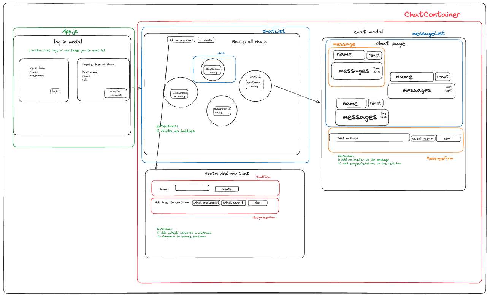
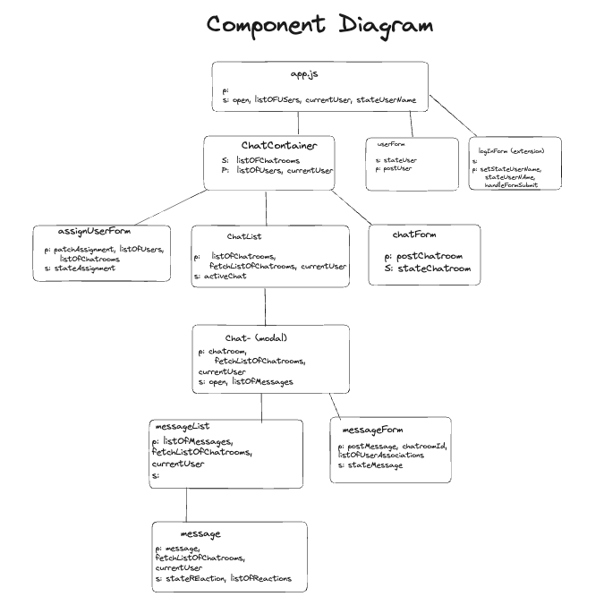

# JARGon REACTors: where JavaScript meets attitude

This project is a front-end REACT application using the following API: [BackEnd Project](https://github.com/Al-B-code/backend_chatroom). In your browser you are able to log in, view all chatrooms, send and react to messages, as well as other features.

### AIM: 
:dart:
To provide a chatroom application which connects users to eachother through messaging and reaction functionalities.

## Contents
- [Project Set Up](#project-set-up)
- [Project MVP and Extensions](#project-MVP-and-extensions)
- [Structure](#Structure)
- [Features](#features)
- [Contributors](#contributors)

## Project Set Up
Clone the above fullstack repository:
```git@github.com:joecarpentieri/chatroom_group1.git```

In the terminal, you can run the following to install the necessary packages:
### ```npm i```
### ```npm install @mui/material @emotion/react @emotion/styled```
### ```npm i react-router-dom```
### ```npm start```

Runs the app.
Open [http://localhost:3000](http://localhost:3000) to view it in your browser.


## Project MVP and Extensions
### MVP
* :white_check_mark: Display a page of all available chats
* :white_check_mark: Add a new chat
* :white_check_mark: Click on a chat to be taken to a new page, display 
all messages in that chatroom
* :white_check_mark: Send a message using a post request from a 
messageForm

### Extensions
* :white_check_mark: Have the home screen as a log in and sign up page
* :white_check_mark: Patch request to react to messages
* :white_check_mark: CSS for bubbles chat
* :white_check_mark: Use routes to create a page to add new chat
* :white_check_mark: Add a user to a chat
* Edit user Info
 
### Advanced Extensions 
* Functionality to log in a user with a password
* Access another API for avatar profile images

## Structure
Built using:
- JavaScript
- CSS
- BackEnd API
- Material UI

Wireframe and Component Diagram:



## Features
1. Log in and sign up page- only existing users can log in
2. Page to view all chatrooms 
3. Page to add new chat and add users to a chat
4. View individual chatrooms and the messages in that chatroom
5. Send a message in a chatroom from one of the users belonging to that chat 
6. React to messages

## Contributors 
JARGon REACTors...
* **J**oe
* **A**anis
* **R**osie
* **G**isele 